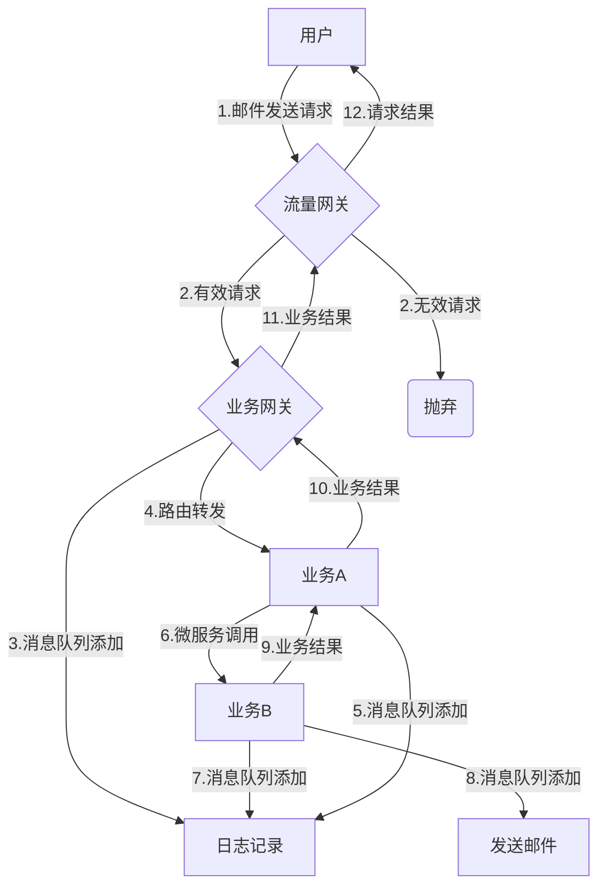

```mermaid
flowchart TD
    A[用户] -->|1.邮件发送请求| B{流量网关}
    B --> |2.有效请求| C{业务网关}
    B --> |2.无效请求| D(抛弃)
    C --> |4.路由转发| E[业务A]
    C --> |3.消息队列添加| G[日志记录]
    E --> |6.微服务调用| F[业务B]
    F --> |7.消息队列添加| G[日志记录]
    E --> |5.消息队列添加| G[日志记录]
    F --> |8.消息队列添加| H[发送邮件]
    F --> |9.业务结果| E
    E --> |10.业务结果| C
    C --> |11.业务结果| B
    B --> |12.请求结果|A
```